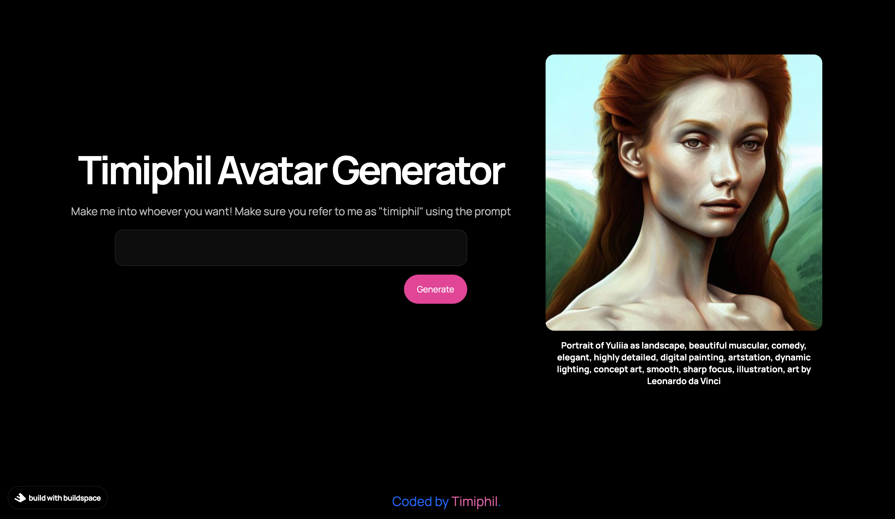

## Timiphil Avatar Generator

This is an AI Avarter generator. It's an incredible web app that is built with Stable Diffusion for ML image diffusion, Dreambooth for training implementation, Hugging Face for hosting pre-trained models, Google Colab for evaluating the model and importing an image dataset, Jupyter notebooks for code execution and visualization of the output, and Next.js a React framework which is the building blocks to create web application.

  
  

# About this Project

This project welcome me to the world of AI generated art through a sick open source software called _“Stable Diffusion”_ like __Dall-e__ or __MidJourney__. __Stable Diffusion__ is game changer - it's techniques helps to fine-tune and combine them with other tech to create extremely accurate depictions of any character on the internet. 
***

1.  Learning on how prompt works where the AI go through process training data, deep learning, latent space, generation, and to output. Using prompt from text to actual image.

2. I trained __Stable Diffusion__ using a technique called Brimbles to teach Stable Diffusion what I look like using identifiers.

3. Building a web application using Next.js for user experience that is deploy through Railway.

***
 

Open [http://localhost:3000](http://localhost:3000) with your browser to see the result.

You can start editing the page by modifying `pages/index.js`. The page auto-updates as you edit the file.

[API routes](https://nextjs.org/docs/api-routes/introduction) can be accessed on [http://localhost:3000/api/hello](http://localhost:3000/api/hello). This endpoint can be edited in `pages/api/hello.js`.

The `pages/api` directory is mapped to `/api/*`. Files in this directory are treated as [API routes](https://nextjs.org/docs/api-routes/introduction) instead of React pages.

## Learn More

To learn more about Next.js, take a look at the following resources:

- [Next.js Documentation](https://nextjs.org/docs) - learn about Next.js features and API.
- [Learn Next.js](https://nextjs.org/learn) - an interactive Next.js tutorial.

You can check out [the Next.js GitHub repository](https://github.com/vercel/next.js/) - your feedback and contributions are welcome!

## Deploy on Vercel

The easiest way to deploy your Next.js app is to use the [Vercel Platform](https://vercel.com/new?utm_medium=default-template&filter=next.js&utm_source=create-next-app&utm_campaign=create-next-app-readme) from the creators of Next.js.

Check out our [Next.js deployment documentation](https://nextjs.org/docs/deployment) for more details.
